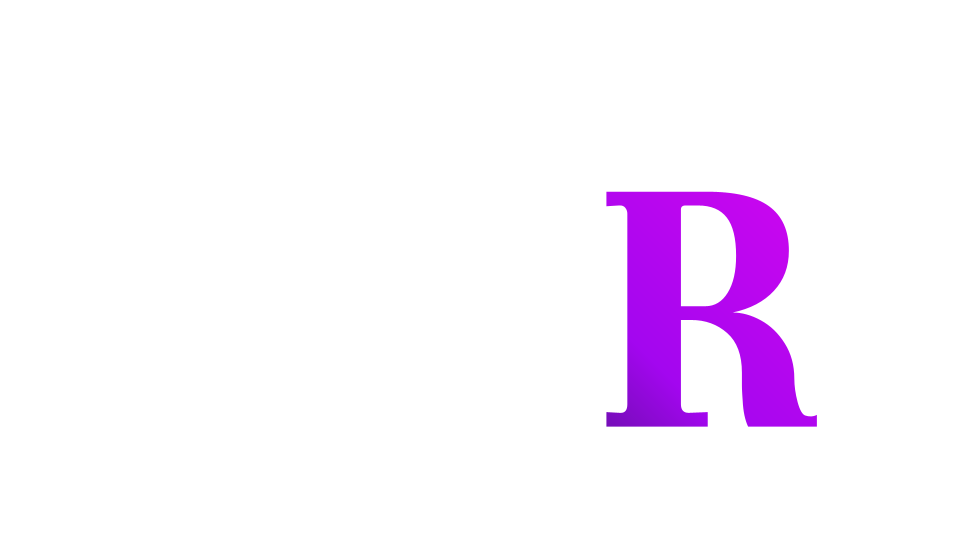

<!-- Improved compatibility of back to top link: See: https://github.com/othneildrew/Best-README-Template/pull/73 -->

<!--
*** Thanks for checking out the Best-README-Template. If you have a suggestion
*** that would make this better, please fork the repo and create a pull request
*** or simply open an issue with the tag "enhancement".
*** Don't forget to give the project a star!
*** Thanks again! Now go create something AMAZING! :D
-->

<!-- PROJECT LOGO -->
 

  
  <h3 align="center">42 Royal - Multiplayer coding game</h3>

<!-- ABOUT THE PROJECT -->
## About The Project

![main-screenshot]

This project is just a POC and was made mainly to learn and try some new stuff.

The idea of this project came to me during the core curriculum of the Ecole 42. I thought that competing with other 42 students on problems that we had during the piscine could be fun. I was thinking about something similar to leetcode but online. Turns out something like this already existed (clash of code), but I though adding some competitive elements, new game mode and flexibility could make this project fun.

Another goal of this project was to learn new web technologies from scratch. It was my second web project after Transcendance (last project of the core curriculum of Ecole 42, an online pong game).

### Built With

![diagram-screenshot]

* [![Next][Next.js]][Next-url]
* ![Express.js]
* ![MongoDB]
* ![Docker]
* 

To process code I used Judge0 (https://judge0.com/)

For WebSocket I used Colyseus.io (https://colyseus.io/)

## Features

*  Game
    - Connected users can join or create a game
    - The game start in a lobby with a chat waiting for all players to be ready
    - The game last until a player has solved all the problems or until the time limit is reached
    - A ranking page is displayed
![createRoom-screenshot]
![game-screenshot]

* Problems
  - It is possible to create and submit a new problem
  - New problems have a status of 'under review' and need to be accepted in the review page
  - There is an administration panel to see and edit any problems
![newProblem-screenshot]
![adminPanel-screenshot]

<!-- MARKDOWN LINKS & IMAGES -->
<!-- https://www.markdownguide.org/basic-syntax/#reference-style-links -->
[Next.js]: https://img.shields.io/badge/next.js-000000?style=for-the-badge&logo=nextdotjs&logoColor=white
[Next-url]: https://nextjs.org/
[React.js]: https://img.shields.io/badge/React-20232A?style=for-the-badge&logo=react&logoColor=61DAFB
[React-url]: https://reactjs.org/
[Express.js]: https://img.shields.io/badge/express.js-%23404d59.svg?style=for-the-badge&logo=express&logoColor=%2361DAFB
[Exoress-url]: https://expressjs.com/
[MongoDB]: https://img.shields.io/badge/MongoDB-%234ea94b.svg?style=for-the-badge&logo=mongodb&logoColor=white
[judge0-url]: https://judge0.com/
[Docker]: https://img.shields.io/badge/docker-%230db7ed.svg?style=for-the-badge&logo=docker&logoColor=white
[main-screenshot]: frontend/assets/main.PNG
[diagram-screenshot]: frontend/assets/ProjectDiagram.PNG
[adminPanel-screenshot]: frontend/assets/adminPanel.PNG
[createRoom-screenshot]: frontend/assets/createRoom.PNG
[game-screenshot]: frontend/assets/gameMode.PNG
[newProblem-screenshot]: frontend/assets/newProblem.PNG
